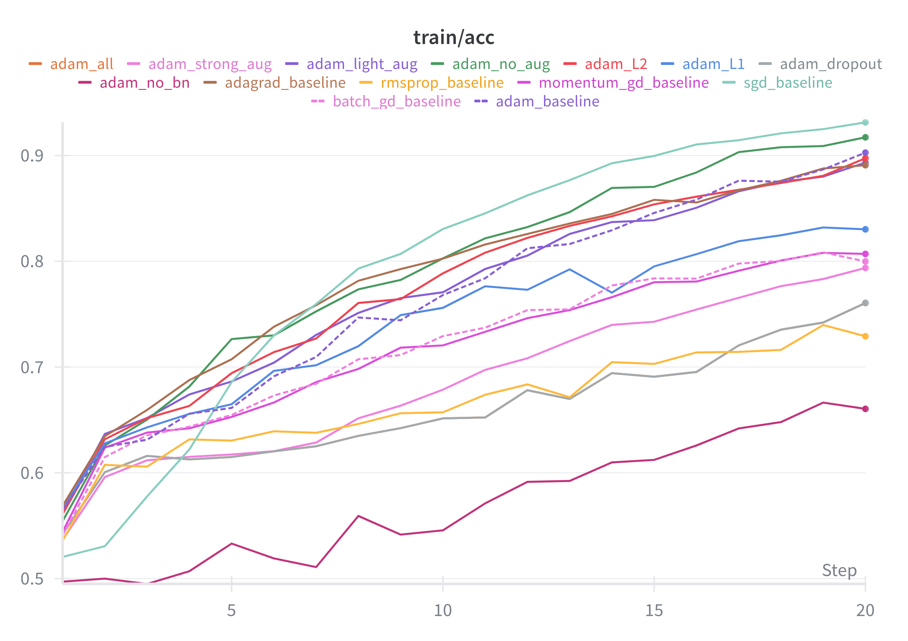

# Deep Learning Optimization and Regularization Framework

A PyTorch-based framework for comparing optimization and regularization techniques on fine-grained image classification.



### 1. Install Dependencies

```bash
pip install -r requirements.txt
```

### 2. Setup Weights & Biases

If you plan to use W&B for experiment tracking:

```bash
wandb login
```

Or set `--no-wandb` flag when running experiments to disable it.

### 3. Download Dataset

```bash
python scripts/download_data.py
```

### Running Experiments

#### Single Experiment

Basic training command:

```bash
python scripts/train.py \
    --dataset-path /path/to/stanford-dogs-dataset \
    --optimizer adam \
    --learning-rate 0.001 \
    --num-epochs 20 \
    --experiment-name adam_baseline \
    --use-wandb
```

#### Experiment Variations

##### 1. Compare Optimizers

```bash
# Adam
python scripts/train.py --dataset-path /path/to/dataset --optimizer adam --experiment-name exp_adam

# SGD with Momentum
python scripts/train.py --dataset-path /path/to/dataset --optimizer momentum --momentum 0.9 --experiment-name exp_sgd_momentum

# RMSProp
python scripts/train.py --dataset-path /path/to/dataset --optimizer rmsprop --experiment-name exp_rmsprop

# Adagrad
python scripts/train.py --dataset-path /path/to/dataset --optimizer adagrad --experiment-name exp_adagrad
```

##### 2. Compare Regularization Techniques

```bash
# With Dropout
python scripts/train.py --dataset-path /path/to/dataset --dropout-rate 0.5 --experiment-name exp_dropout

# With L1 Regularization
python scripts/train.py --dataset-path /path/to/dataset --lambda-l1 0.0001 --experiment-name exp_l1

# With L2 Regularization (weight decay)
python scripts/train.py --dataset-path /path/to/dataset --weight-decay 0.0001 --experiment-name exp_l2

# Without Batch Norm
python scripts/train.py --dataset-path /path/to/dataset --no-batch-norm --experiment-name exp_no_bn
```

##### 3. Compare Data Augmentation

```bash
# No augmentation
python scripts/train.py --dataset-path /path/to/dataset --no-augmentation --experiment-name exp_no_aug

# Light augmentation
python scripts/train.py --dataset-path /path/to/dataset --augmentation-strength light --experiment-name exp_aug_light

# Strong augmentation
python scripts/train.py --dataset-path /path/to/dataset --augmentation-strength strong --experiment-name exp_aug_strong
```

##### 4. Combined Experiments

```bash
# Adam + Dropout + Data Augmentation
python scripts/train.py \
    --dataset-path /path/to/dataset \
    --optimizer adam \
    --dropout-rate 0.5 \
    --use-augmentation \
    --augmentation-strength medium \
    --experiment-name exp_adam_dropout_aug
```

### Important Parameters to Consider

#### Optimizer-Specific Parameters

- **SGD/Momentum**: `--momentum` (default: 0.9)
- **Adam**: `--learning-rate` (default: 0.001, typically lower than SGD)
- **RMSProp**: Uses default PyTorch parameters
- **Learning Rate**: Start with 0.001 for Adam, 0.01 for SGD

#### Regularization Parameters

- **L1 Regularization**: `--lambda-l1` (try: 0.0001, 0.001, 0.01)
- **L2 Regularization**: `--weight-decay` (try: 0.0001, 0.001, 0.01)
- **Dropout**: `--dropout-rate` (try: 0.3, 0.5, 0.7)
- **Batch Norm**: Enabled by default, use `--no-batch-norm` to disable

#### Training Parameters

- **Batch Size**: `--batch-size` (default: 32, adjust based on GPU memory)
- **Number of Epochs**: `--num-epochs` (start with 20-30 for initial experiments)
- **Image Size**: `--image-size` (default: 224, standard for ImageNet-based models)

### Experiment Naming Convention

Use descriptive names that include key parameters:

```
{optimizer}_{regularization}_{augmentation}
```

Examples:
- `adam_baseline` - Adam optimizer, no regularization
- `sgd_l1_dropout` - SGD with L1 and dropout
- `adam_aug_strong` - Adam with strong augmentation

### After Training

#### 1. Evaluate Models

```bash
python scripts/evaluate.py \
    --checkpoint results/experiment_name/best_model.pth \
    --dataset-path /path/to/dataset \
    --model-variant resnet18
```

#### 2. Analyze Results

Compare multiple experiments:

```bash
python scripts/analyze_results.py \
    --results-dir results \
    --experiments exp_adam exp_sgd exp_rmsprop \
    --output-dir results/plots
```

Or analyze all experiments:

```bash
python scripts/analyze_results.py \
    --results-dir results \
    --output-dir results/plots
```


### Features

- **Optimizers**: GD, SGD, Momentum, Adagrad, RMSProp, Adam
- **Regularization**: L1/L2, Dropout, Batch Normalization, Data Augmentation
- **Architecture**: ResNet18/34 with configurable regularization
- **Tracking**: Weights & Biases integration
- **Visualization**: Automatic plot generation for comparisons


### Key Scripts

- `scripts/train.py` - Main training script (command-line arguments)
- `scripts/train_from_config.py` - Train from configuration files
- `scripts/evaluate.py` - Model evaluation
- `scripts/analyze_results.py` - Generate comparison plots


### Requirements

- Python 3.10+
- PyTorch 2.0+
- CUDA (optional, for GPU acceleration)

### License

This project is for educational/research purposes.

